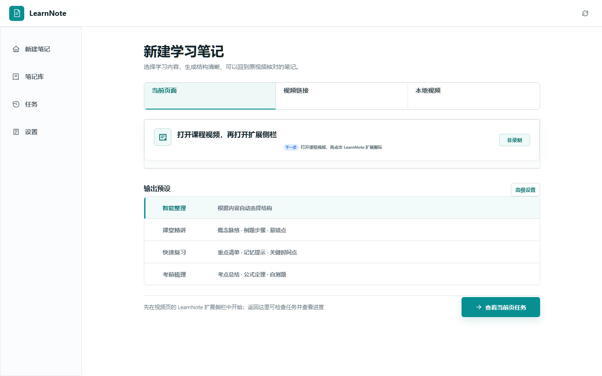
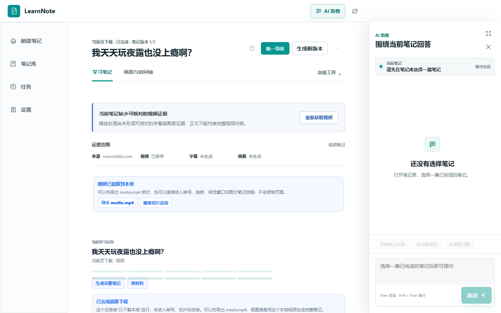
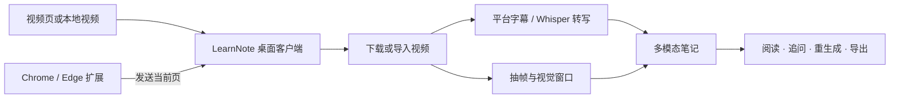

# LearnNote

> 把正在播放的课程或本地视频，整理成可以核对画面、回到时间点、继续追问的学习笔记。

[](https://github.com/hurry060215-tech/learnnote-assistant/releases/latest)
[](https://github.com/hurry060215-tech/learnnote-assistant/releases/latest)
[](https://github.com/hurry060215-tech/learnnote-assistant/releases/latest)

[产品网站](https://learnnote-study.hurry060215.chatgpt.site) · [下载最新版](https://github.com/hurry060215-tech/learnnote-assistant/releases/latest) · [反馈问题](https://github.com/hurry060215-tech/learnnote-assistant/issues)



## LearnNote 是什么

LearnNote 是一个以 **Windows 桌面客户端** 为核心的视频学习助手。它不录制浏览器标签页，而是尽可能读取当前页面已经加载的视频资源，把视频下载到本地后再完成字幕获取、语音转写、画面切片和笔记生成。

你可以从三种入口开始：

- **当前页面**：在 B 站、YouTube、学习通等视频页打开浏览器扩展，一键发送到 LearnNote。
- **视频链接**：粘贴 B 站网址、BV/av 号、YouTube 地址或普通视频链接。
- **本地视频**：拖入 MP4、MKV、WebM、MOV 等文件，直接使用完整处理流程。

浏览器扩展只负责识别当前页面并发送任务。下载、转写、切片、总结、笔记库、AI 问答和导出都在桌面客户端中完成。

## 核心能力

### 当前页视频直取

- 识别页面中的 MP4、FLV、HLS、DASH、iframe 播放器和 yt-dlp 支持页面。
- 在用户点击发送时同步当前登录会话需要的 Cookie 和安全请求头。
- 自动预检候选资源，跳过失效链接并选择当前可访问的视频。
- 支持 B 站完整网址、`BV...`、`av...` 以及 YouTube 等常见视频页面。
- 下载失败时给出具体原因和下一步，而不是生成与视频无关的笔记。

### 字幕、转写与画面理解

- 优先使用浏览器字幕、平台字幕和视频内嵌字幕。
- 没有字幕时可使用本地 `faster-whisper` 或 OpenAI-compatible / Groq ASR。
- 按自定义间隔抽取关键帧，组合成视觉窗口，并与对应时间段字幕对齐。
- 支持视觉模型时，结合 PPT、板书、代码和操作演示生成多模态笔记。
- 没有视觉模型时，仍可生成基于字幕和画面索引的文本笔记。

### 可继续使用的笔记

- 时间轴笔记、字幕、画面切片和本地视频可以互相定位。
- 同一个视频可以更换结构和风格，生成多个笔记版本。
- 阅读时可在 AI 侧栏围绕当前课程继续提问。
- 支持 Markdown、字幕、诊断报告、媒体文件和完整学习资料包导出。
- 任务诊断会说明视频来源、下载路径、字幕来源、模型降级和修复建议。



## 五分钟开始使用

### 1. 安装桌面客户端

从 [Releases](https://github.com/hurry060215-tech/learnnote-assistant/releases/latest) 下载：

- `LearnNote-Setup-x64.exe`：Windows 安装版，推荐大多数用户使用。
- `LearnNote-Windows-x64.zip`：免安装便携版。
- `LearnNote-Browser-Extension-*.zip`：单独下载浏览器扩展时使用。
- `SHA256SUMS.txt`：安装包校验值。

建议安装到 `D:\LearnNote` 或其他非系统盘。视频、模型和任务产物的数据目录可以在客户端设置中修改。

### 2. 启动 LearnNote

运行 `LearnNote.exe`。客户端后端默认只监听：

```text
http://127.0.0.1:8765
```

这不是需要登录的网站，而是桌面客户端在本机使用的服务地址。

### 3. 连接浏览器扩展

1. 在客户端打开 **设置 → 浏览器扩展**。
2. 点击 **修复连接**，让客户端打开扩展目录和浏览器扩展管理页。
3. 在 `chrome://extensions` 或 `edge://extensions` 开启 **开发者模式**。
4. 点击 **加载已解压的扩展程序**，选择客户端显示的 `extension` 文件夹。
5. 回到视频页，刷新一次页面，再打开 LearnNote 扩展侧栏。

扩展显示“本地服务已连接”后，播放目标视频并点击 **发送到 LearnNote**。任务会自动出现在桌面客户端。

### 4. 选择笔记方式

首次使用建议保持默认配置：

- 笔记结构：**智能整理**
- 转写：**本地 faster-whisper / small**
- 视觉理解：有视觉模型时开启
- 切片间隔：20 秒
- 视觉窗口：3 × 3

课程以讲解为主可选“课堂精讲”，临时复习可选“快速复习”，备考时可选“考前梳理”。同一个视频之后可以重新选择配置，不必重新下载。

## 支持范围

| 来源 | 推荐入口 | 说明 |
| --- | --- | --- |
| Bilibili | 视频网址、BV/av 号、当前页扩展 | 优先使用 yt-dlp，扩展可补充当前登录会话 |
| YouTube | 视频网址、当前页扩展 | 公开或当前账号可访问的视频 |
| 学习通 / 超星 | 当前页扩展 | 需要先登录并播放；页面必须向浏览器暴露可访问的视频资源 |
| 普通 MP4 / HLS / DASH | 视频链接或当前页扩展 | 支持直接文件和常见流媒体清单 |
| 本地视频 | 客户端拖拽上传 | 最稳定，不依赖网站解析 |

如果网页采用受保护的加密播放，或没有向浏览器提供可复用的视频地址，LearnNote 会停止下载并提示改用本地视频。它不会代替用户完成课程、伪造进度或绕过网站权限。

## 模型配置

模型统一在客户端 **设置 → AI 模型 / 转写** 中配置。当前支持常见 OpenAI-compatible 服务以及内置提供商预设：

- Kimi、通义千问、智谱 GLM
- DeepSeek、豆包、MiniMax、百度千帆
- OpenAI、Groq、Gemini 和自定义兼容接口

需要看懂 PPT、板书、代码界面或操作过程时，请选择明确支持图片输入的视觉模型。DeepSeek 等纯文本模型适合根据字幕生成文本笔记，但不会分析画面。

API Key 可以保存在 Windows 凭据管理器中，不会写入任务 JSON、诊断文件或导出资料。不要把密钥提交到 Git 仓库。

## 工作流程



所有任务默认保存在本机数据目录中。当前页 Cookie 只在用户主动发送或预检任务时读取，并仅交给本地后端处理。

## 常见问题

### 扩展已经加载，为什么没有发送到客户端？

先确认客户端正在运行，扩展顶部显示“本地服务已连接”。如果仍然失败：

1. 客户端进入 **设置 → 浏览器扩展 → 修复连接**。
2. 在扩展管理页点击 LearnNote 的 **重新加载**。
3. 刷新视频页面并重新播放几秒钟。
4. 确认扩展和客户端来自同一个发布版本。

### 视频明明在播放，为什么没有识别到？

有些播放器会先创建 `blob:` 地址，再在后台加载真正的视频。LearnNote 会尝试从网络请求、iframe 和播放器配置中恢复资源；如果页面只提供无法复用的加密数据，扩展会提示使用链接解析或本地上传。

### 为什么笔记和视频内容不一致？

在任务诊断中检查三项：下载到的视频是否正确、字幕来源是否可靠、视觉模型是否真的启用。LearnNote 不会把错误页或模型报错当成课程内容；证据不足时应重新获取视频或更换字幕 / 转写设置。

### 一定需要下载客户端吗？

是。当前版本以桌面客户端为处理核心；浏览器扩展只是当前页入口，宣传网站只用于介绍和下载产品。

## 从源码运行

要求：Windows 10/11、PowerShell、Python 3.11+、Chrome 或 Edge。ffmpeg 和 yt-dlp 可由启动脚本检查和配置。

```powershell
git clone https://github.com/hurry060215-tech/learnnote-assistant.git D:\Projects\learnnote-assistant
cd D:\Projects\learnnote-assistant
.\scripts\first-run-checklist.ps1
.\start-learnnote.ps1
```

安装本地 Whisper：

```powershell
.\start-learnnote.ps1 -InstallAsr
.\scripts\doctor.ps1
```

加载源码扩展时，在浏览器扩展管理页选择：

```text
D:\Projects\learnnote-assistant\extension
```

## 开发与验证

窄范围修改优先运行：

```powershell
.\scripts\audit-stage.ps1
```

完整产品验收：

```powershell
.\scripts\verify-product.ps1 -Browser edge
.\scripts\audit-product-readiness.ps1
```

扩展与当前页流程：

```powershell
.\scripts\e2e-extension-smoke.ps1 -Browser edge
```

真实网站验证会访问第三方站点，应使用你有权访问的内容，并遵守对应网站条款：

```powershell
.\scripts\audit-real-site.ps1 "https://example.com/video" -Preflight -RequireReady
```

## 项目结构

```text
backend/      FastAPI 后端、下载器、转写、切片和笔记任务
desktop/      Windows 桌面壳与更新、安装相关逻辑
extension/    Chrome / Edge Manifest V3 扩展
web/          桌面客户端中的工作台与笔记库界面
scripts/      启动、诊断、测试和发布脚本
site/         GitHub Pages 宣传页面
```

## 隐私与数据

- 客户端后端默认仅监听 `127.0.0.1`。
- 视频、字幕、截图、模型缓存和任务产物保存在用户选择的本地数据目录。
- Cookie 仅在用户主动发起当前页任务时读取，不会持续后台采集。
- 导出和诊断会隐藏 Cookie、Authorization 和敏感请求参数。
- 本项目用于整理用户有权访问的视频内容，不用于刷课、自动答题或伪造学习进度。
