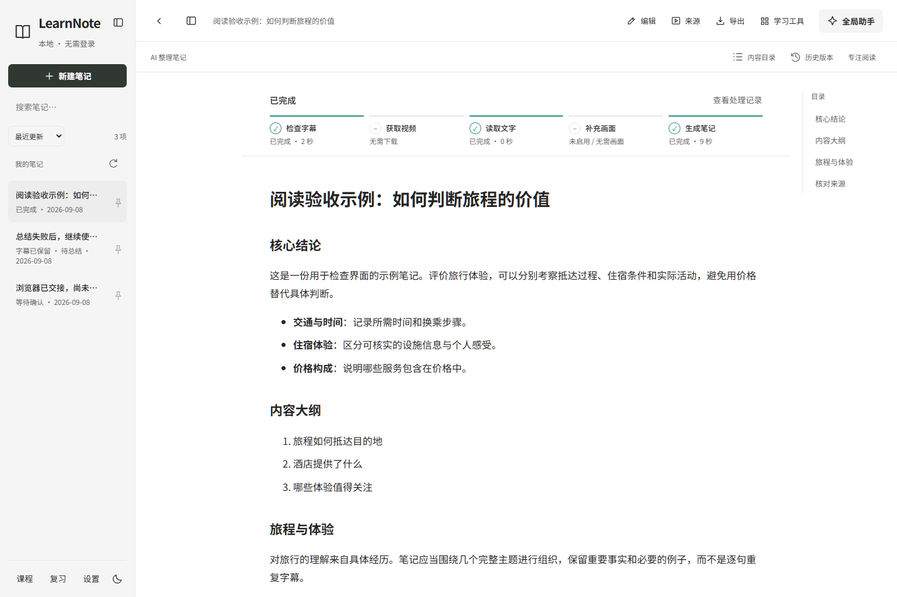

# LearnNote

### 看过的内容，变成自己的笔记。

字幕优先的视频笔记、本地学习资料、可追问的 AI 助手。双击启动 App，在网页工作台里阅读、编辑、回到来源；不用注册 LearnNote 账号。

[下载 Windows 版](https://github.com/hurry060215-tech/learnnote-assistant/releases/latest) · [产品与使用流程](https://hurry060215-tech.github.io/learnnote-assistant/) · [安装浏览器扩展](docs/EXTENSION_CONNECTION.md) · [使用帮助](SUPPORT.md)

> **开发分支说明：** 下文介绍当前分支的能力。正式安装包与扩展商店版可能尚未包含这些改进，请以对应 [Release 的版本和更新说明](https://github.com/hurry060215-tech/learnnote-assistant/releases)为准。



_工作台的界面验收截图，使用演示资料。界面展示不代表真实模型效果。_

## 三步开始，不用命令行

1. **启动 App。** 下载 Windows 安装包，或解压便携 ZIP 后双击 `LearnNote.exe`。网页工作台连接本机服务，笔记保存在本机。
2. **添加内容。** 粘贴视频网址、选择本地视频，或导入 PDF、Markdown、TXT、HTML。普通链接不要求安装扩展。
3. **选择模型并整理。** 在设置中配置文字模型，确认本次来源和处理方式。任务页展示进度和记录；完成后阅读总结、编辑正文或导出。

已登录的 B 站或课程页面，可以使用浏览器扩展交接当前页面可访问的字幕与资源。在扩展里查看连接和字幕状态，再发送到本机工作台。**只粘贴网址不会自动获取另一个浏览器的登录态。**

[Chrome 商店](https://chromewebstore.google.com/detail/learnnote-%E5%BD%93%E5%89%8D%E8%A7%86%E9%A2%91%E5%8A%A9%E6%89%8B/mncdchpkpikhacmkbanedpppcddapppe) · [离线安装、唤起 App 与连接排查](docs/EXTENSION_CONNECTION.md)

## 从字幕到笔记，每一步清楚可见

| 当前条件                 | 程序做什么                                       | 你得到什么                               |
| ------------------------ | ------------------------------------------------ | ---------------------------------------- |
| 有可用字幕，无需画面分析 | 读取字幕，跳过视频下载和语音转写，再调用文字模型 | 概览、重点、来源时间点；字幕原文独立保留 |
| 没有可用字幕             | 获取媒体，按所选方式转写，再整理                 | 可回看时间点的转写与笔记                 |
| 需要截图或画面理解       | 额外获取视频与必要画面；视觉模型按需处理         | 图文补充和对应来源                       |
| 没有配置文字模型         | 展示可用原文或字幕，明确结果性质                 | 原文材料，**不是 AI 总结**               |
| 总结服务报错或额度不足   | 显示失败原因，保留已有字幕；修复配置后重试整理   | 不必为了重做总结重复转写                 |
| 导入文档                 | 提取可读原文                                     | 本地阅读、检索、批注；扫描 PDF 需先 OCR  |

任务状态区说明当前步骤、已完成和跳过的步骤。处理记录用于查看耗时、提示和失败原因。需要更深入排查时，在任务的 **更多 → 诊断** 中查看记录；分享前仍应检查并移除私人内容。

本地转写采用 faster-whisper。首次使用需要下载对应模型；速度与视频时长、模型大小、CPU/GPU 和硬件环境有关。画面 OCR 用于抽帧文字提取，**完整画面字幕 OCR 尚未作为自动回退流程提供**。

## 读懂内容，也能继续加工

- **正文与来源分开。** 总结用于组织重点，字幕用于核对原话；通过时间点回到视频，不把时间戳当成事实认证。
- **全局助手与显式 Skill。** 可以问怎么操作、检查环境、搜索资料，也可围绕选中内容提问、总结、自测；回复展示使用的 Skill、范围和执行方式。
- **保留自己的理解。** 编辑笔记正文，保存个人补充；原始生成稿与修订稿分别保留。课程、复习卡、学习计划和版本记录继续可用。
- **按自己习惯阅读。** 折叠侧栏、查看大纲，调整字体、字号、行距、阅读宽度、主题与密度。原有导出、片段学习、OCR 和诊断入口仍可发现。
- **选择自己的模型。** 可配置文字与视觉服务，使用服务预设或兼容接口；本地模型服务也可连接。模型账号和额度由用户自己的提供商管理。

[全局助手与 Skill](docs/GLOBAL_ASSISTANT.md) · [模型与设置帮助](SUPPORT.md) · [Obsidian 集成](integrations/obsidian-learnnote/README.md)

## 本地优先，有清楚的边界

视频、字幕、笔记、补充和复习记录默认放在本机。LearnNote 没有自有云任务、产品遥测，也不要求产品账号。

下载内容会访问来源网站；选择远程文字、视觉或转写服务时，该服务会接收完成任务所需的内容。本地转写不向模型 API 上传音频，但首次需要下载模型权重。桌面端可用系统凭据库保存 API Key；不要把密钥写入仓库、公开 Issue 或截图。

浏览器扩展在用户触发的工作流中交接当前会话可访问的内容，不录制标签页，不绕过 DRM、账号权限或课程进度。手机窄屏可阅读网页，但默认服务只供本机访问；跨设备同步和独立手机 App 不在当前承诺内。

[隐私说明](PRIVACY.md) · [安全说明](SECURITY.md) · [第三方许可](THIRD_PARTY_NOTICES.md)

## 支持与反馈

Windows 10 / 11 x64 是主要桌面平台。支持本地视频、Bilibili、YouTube 和当前会话有权访问的常见媒体资源。站点更新、登录失效或加密播放可能影响获取；可用本地文件继续。

macOS / Linux 的基础合约检查不等于已完成原生桌面签名、安装和升级验收。

[来源兼容矩阵](docs/SOURCE_COMPATIBILITY_MATRIX.md) · [平台支持](docs/PLATFORM_SUPPORT.md) · [提交问题](https://github.com/hurry060215-tech/learnnote-assistant/issues)

反馈请附输入类型、复现步骤、预期与实际结果，以及已检查的处理记录。安全问题使用[私密漏洞报告](https://github.com/hurry060215-tech/learnnote-assistant/security/advisories/new)，不要公开凭据或未脱敏任务包。

## 参与开发

普通使用请选择安装包。开发环境可运行：

```powershell
git clone https://github.com/hurry060215-tech/learnnote-assistant.git D:\Projects\learnnote-assistant
cd D:\Projects\learnnote-assistant
.\scripts\first-run-checklist.ps1
.\start-learnnote.ps1
```

后端回归：

```powershell
$env:PYTHONPATH = "backend"
.\.venv\Scripts\python.exe -m unittest discover backend/tests
.\.venv\Scripts\python.exe -m unittest discover scripts/tests
```

主工作台在 `web/desk*`，浏览器扩展在 `extension/`，后端在 `backend/app/`，静态官网在 `site/`。旧界面仅作为源码历史回归参考，不进入桌面发行包。

[架构](docs/ARCHITECTURE.md) · [贡献指南](CONTRIBUTING.md) · [发布流程](docs/RELEASING.md) · [产品参考与取舍](docs/PRODUCT_REFERENCE_REVIEW.md)

感谢 [BiliNote](https://github.com/JefferyHcool/BiliNote) 的字幕优先与视频笔记工作流、[Cetle / B 站视频总结](https://api.cetle.cn/) 的字幕与学习工具组织，以及 [Cherry Studio](https://github.com/CherryHQ/cherry-studio) 的多模型客户端交互参考。参考产品结构不意味着这些项目的全部代码采用同一种许可证；来源与复用范围见[参考说明](docs/PRODUCT_REFERENCE_REVIEW.md)。

LearnNote 采用 [Apache License 2.0](LICENSE)。
