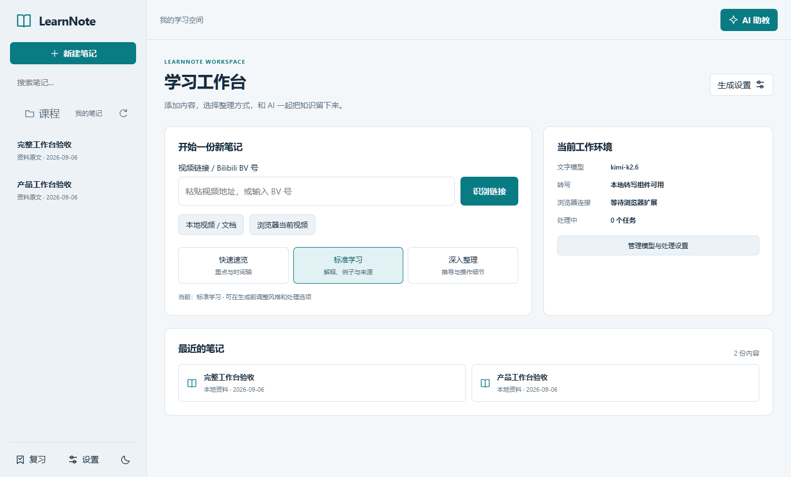
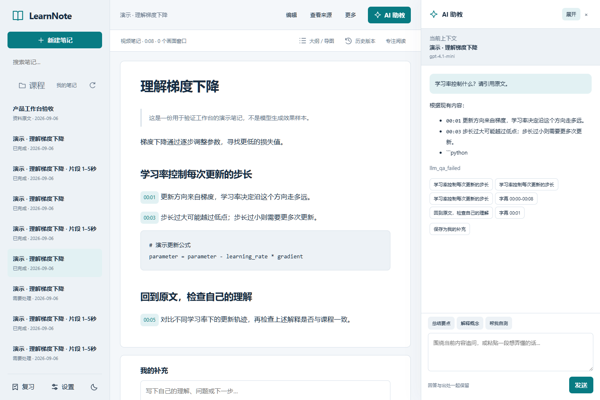

# LearnNote

**面向愿意掌控模型和处理过程的学习者：视频、字幕、图文笔记与 AI 助教，在同一个本地工作台里。**

LearnNote 是一个本地优先的个人学习工具。添加视频或资料，在同一个工作台里读笔记、打开来源、写下自己的理解，然后导出带走。

[下载最新发布版](https://github.com/hurry060215-tech/learnnote-assistant/releases/latest) · [安装浏览器扩展](https://chromewebstore.google.com/detail/learnnote-%E5%BD%93%E5%89%8D%E8%A7%86%E9%A2%91%E5%8A%A9%E6%89%8B/mncdchpkpikhacmkbanedpppcddapppe) · [报告问题](https://github.com/hurry060215-tech/learnnote-assistant/issues)

> 当前分支正在进行工作台重设计。下文的新界面与编辑流程属于本分支，不代表已进入正式 Release。已发布安装包的版本和功能以下载页说明为准。



*打包后的 Windows 客户端实拍；内容为演示资料，不代表模型生成质量。*

## 开始使用

1. 下载 Windows 安装包或便携 ZIP，启动 `LearnNote.exe`。
2. 点击 **新建笔记**，粘贴视频链接，或选择本地视频、PDF、Markdown、TXT、HTML。
3. 视频有字幕时优先使用字幕；没有字幕时，需要可用的转写能力。文档导入后直接阅读原文。
4. 打开 **设置** 配置文字模型，可以生成整理后的笔记。未配置时，结果明确标为字幕摘录。
5. 在正文中阅读；点击 **查看来源** 打开视频和字幕。使用 **编辑** 修改笔记，或在 **我的补充** 写下自己的理解。

工作台首页显示模型、转写、扩展连接与任务状态；AI 助教始终可以直接打开。设置按模型、字幕与转写、笔记模板、视频资源、阅读外观、存储连接分区。新工作台将笔记列表、阅读和来源放在一起。编辑稿独立保存，原始生成稿仍然保留；导出 Markdown 时使用当前编辑稿。课程在侧栏管理；复习卡、提问、片段学习、OCR、导出与补充编辑均在当前笔记的“更多”菜单中完成。存储、备份、恢复与复习计划在设置中管理。

## 当前浏览器里的视频

需要登录的页面，通常更适合通过扩展交接：

1. 保持客户端运行，在电脑浏览器打开并播放视频。
2. 打开 LearnNote 扩展，点击 **发送到 LearnNote**。
3. 客户端左侧出现任务后，确认并开始整理。

扩展只在用户触发时收集当前页可访问的资源，不录制标签页，也不绕过 DRM、账号权限或课程进度。普通链接不必安装扩展。离线扩展 ZIP 可在 Chrome / Edge 的扩展管理页通过“加载已解压的扩展程序”安装。



*AI 助教恢复为常驻入口，保留当前来源、对话历史、引用和保存回答。截图是界面验收样本，不代表真实模型效果。*

## 笔记是怎样得到的

| 情况 | 实际结果 |
| --- | --- |
| 有字幕和文字模型 | 根据字幕整理内容，保留来源时间点 |
| 没有字幕，但本地转写可用 | 先转写，再整理；首次使用需要下载模型权重 |
| 没有文字模型 | 提供清楚标注的字幕摘录，不伪装成知识提炼 |
| 开启画面理解且视觉模型可用 | 必要画面发送给你选择的模型，补充视觉内容 |
| 导入文档 | 保留可提取原文；扫描 PDF 需要先 OCR |

生成内容仍可能有错。时间戳表示可以回到来源，**不表示事实已经核验**。本地降级笔记不补写通用易错点或凭空出题；长字幕按块处理，避免只读开头。

## 本地优先意味着什么

- 视频、字幕、笔记、个人补充和复习记录默认保存在本机。
- 没有 LearnNote 官方账号、官方云任务或产品遥测。
- 下载内容会访问来源网站；远程文字、视觉或转写服务会接收完成处理所需的内容。
- API Key 不写入新工作台的浏览器存储；桌面端可使用系统凭据库保存。
- 手机窄屏可以阅读界面，但当前桌面服务默认只供本机访问；没有宣称跨设备同步或独立手机 App。

完整边界：[隐私说明](PRIVACY.md) · [安全说明](SECURITY.md) · [第三方许可](THIRD_PARTY_NOTICES.md)。

## 支持范围

Windows 10 / 11 x64 是主要桌面平台。macOS / Linux 的本地合约检查不等于已完成签名、安装和原生桌面发行验证。

支持来源包括本地视频、Bilibili、YouTube，以及当前会话有权访问的普通 MP4 / HLS / DASH 等资源。站点更新、登录失效或加密播放可能导致获取失败，可改用本地文件。

[来源兼容矩阵](docs/SOURCE_COMPATIBILITY_MATRIX.md) · [平台支持](docs/PLATFORM_SUPPORT.md) · [使用与恢复帮助](SUPPORT.md)

## 开发运行

```powershell
git clone https://github.com/hurry060215-tech/learnnote-assistant.git D:\Projects\learnnote-assistant
cd D:\Projects\learnnote-assistant
.\scripts\first-run-checklist.ps1
.\start-learnnote.ps1
```

已配置 Python 环境时，也可运行后端并访问它提供的工作台：

```powershell
$env:PYTHONPATH = "backend"
.\.venv\Scripts\python.exe -m uvicorn app.main:app --host 127.0.0.1 --port 8765
```

统一界面：`web/index.html`、`web/desk.css`、`web/desk.js`、`web/desk-api.js`、`web/desk-tools.js`。旧界面仅留在源码中供历史回归，安装包不再包含旧页面和旧主脚本。产品对比与功能恢复依据见 [指定参考整合说明](docs/PRODUCT_REFERENCE_REVIEW.md)。

来源摘录和分块逻辑：`backend/app/reading_notes.py`。

```powershell
$env:PYTHONPATH = "backend"
.\.venv\Scripts\python.exe -m unittest discover backend/tests
.\.venv\Scripts\python.exe -m unittest discover scripts/tests
```

[架构说明](docs/ARCHITECTURE.md) · [贡献指南](CONTRIBUTING.md) · [发布流程](docs/RELEASING.md) · [重设计记录](docs/REDESIGN.md) · [Obsidian 集成](integrations/obsidian-learnnote/README.md)

## 反馈

请说明输入类型、复现步骤、预期行为与实际结果。公开 Issue 前移除 Cookie、API Key、私人网址和未脱敏资料。安全问题请使用[私密漏洞报告](https://github.com/hurry060215-tech/learnnote-assistant/security/advisories/new)。

LearnNote 采用 [Apache License 2.0](LICENSE)。
