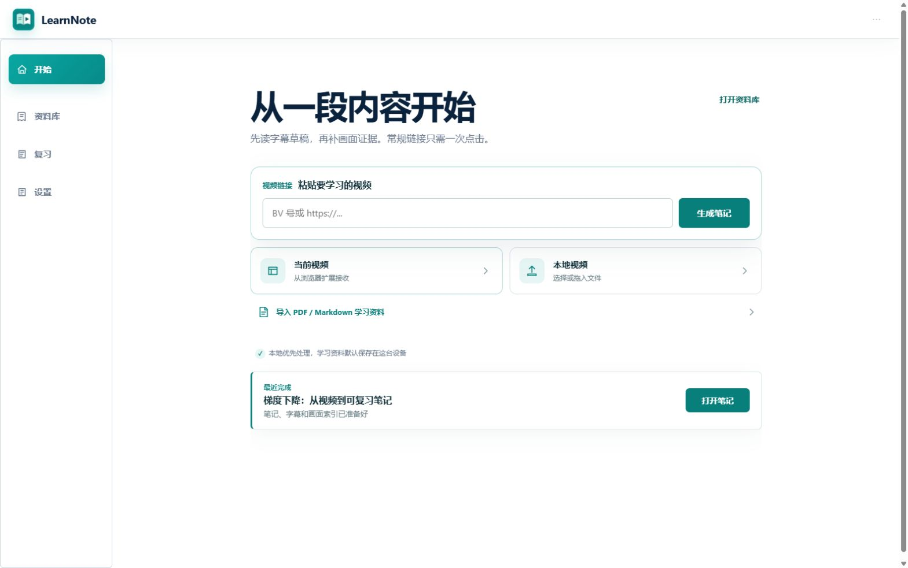

<div align="center">

# LearnNote

## 把视频和本地资料，变成能核验、能复习、由你掌控的学习系统

从正在看的网页视频、视频链接或本地文件开始。LearnNote 先整理可阅读的字幕与笔记，
再把关键画面、时间轴和来源证据放回同一条学习路径。

*A local-first, evidence-grounded learning workspace for videos and documents.*

[](https://github.com/hurry060215-tech/learnnote-assistant/releases/latest)
[](https://github.com/hurry060215-tech/learnnote-assistant/releases/latest)
[](https://chromewebstore.google.com/detail/learnnote-%E5%BD%93%E5%89%8D%E8%A7%86%E9%A2%91%E5%8A%A9%E6%89%8B/mncdchpkpikhacmkbanedpppcddapppe)
[](LICENSE)

[下载 Windows 稳定版](https://github.com/hurry060215-tech/learnnote-assistant/releases/latest) ·
[安装 Chrome 扩展](https://chromewebstore.google.com/detail/learnnote-%E5%BD%93%E5%89%8D%E8%A7%86%E9%A2%91%E5%8A%A9%E6%89%8B/mncdchpkpikhacmkbanedpppcddapppe) ·
[快速开始](#快速开始) ·
[产品路线图](https://github.com/hurry060215-tech/learnnote-assistant/issues/52)

</div>

> [!NOTE]
> **当前稳定版是 v0.1.55。** 本 README 同时介绍已经进入 `main`、但尚未随稳定安装包发布的预览能力；它们会明确标为 **main 预览**。

<div align="center">
  
</div>

> 上图来自当前 `main` 的隔离本地运行实拍，不是概念设计。v0.1.55 稳定版界面和能力以 Release 安装包为准。

## 30 秒理解 LearnNote

| 输入 | 先读 | 核验 | 复习 | 带走 |
| --- | --- | --- | --- | --- |
| 当前网页、视频链接、本地视频；文档为 **main 预览** | 字幕与基础笔记准备好后开始阅读 | 回到时间戳和关键画面；页码/段落为 **main 预览** | 围绕证据提问；完整学习卡片体验为 **main 预览** | 导出 Markdown、资料包或同步到自己的工具 |

LearnNote 不替你刷课，也不承诺“一键学会”。它把最耗时的整理、定位和回顾工作做好，让你更快进入理解、核验和复习。

## 为什么不是普通视频摘要器

| 普通视频摘要 | LearnNote |
| --- | --- |
| 把字幕压缩成一段文字 | 对齐字幕、关键画面和视频时间轴 |
| 摘要看起来通顺，但出处不清楚 | 重要内容尽可能回到可检查的来源 |
| 生成完成才看到结果 | **main 预览：**字幕就绪后先开放草稿，画面证据继续补充 |
| 生成后流程结束 | 笔记可以继续问答、导出并进入本地复习 |
| 数据边界由云服务决定 | 本地数据目录由用户控制，远程模型按需配置 |
| 失败时仍可能生成无关内容 | 证据不足时降级、停止或给出恢复建议 |

## 适合谁

- 经常学习 Bilibili、YouTube、学习通、课程录像或技术教程的个人学习者；
- 需要整理 PPT、板书、公式、代码界面和操作步骤的人；
- 复习时希望快速跳回原视频或原始文档核对内容的人；
- 希望视频、PDF、Markdown 和复习记录留在自己设备中的用户。

如果你只需要无需客户端的一次性云摘要、多人云协作，或希望绕过 DRM、付费墙和课程权限，LearnNote 并不适合这些用途。

## 从输入到真正可用的学习资料

### 1. 输入

- **当前网页：**在 Chrome 视频页打开 LearnNote 扩展，确认后发送到本机客户端；
- **视频链接：**粘贴 B 站网址、BV/av 号、YouTube 地址或普通媒体链接；
- **本地视频：**导入 MP4、MKV、WebM、MOV 等文件；
- **main 预览：**PDF、Markdown、HTML、TXT 与本地视频可进入统一资料库。

### 2. 先读

- 优先使用平台字幕、浏览器字幕和视频内嵌字幕；
- 没有字幕时可使用本地 `faster-whisper` 或用户配置的远程 ASR；
- **main 预览：**字幕完成后先生成可阅读草稿，不必等待全部视觉分析；
- 任务失败时保留诊断、重试和可恢复阶段，而不是用错误页面凑出笔记。

### 3. 核验

- 关键帧按时间窗口与对应字幕一起整理；
- 配置视觉模型后，可以补充 PPT、板书、代码和操作画面；
- 没有视觉模型时，仍保留字幕笔记和画面索引，不冒充已经理解画面；
- **main 预览：**章节带稳定证据 ID、时间戳与验证状态，严重乱码会被隔离。

### 4. 复习

- 围绕当前课程和本地证据继续提问；
- 同一个视频可以复用已下载媒体，重新整理为不同用途的笔记；
- **main 预览：**从真实本地证据生成卡片，并使用本地 FSRS 记录复习；
- 评论与弹幕只属于可选的“社区观点”层，不会混入课程主证据。

### 5. 带走

- 稳定版支持 Markdown、字幕、诊断、媒体和学习资料包导出；
- [Obsidian 插件](integrations/obsidian-learnnote/README.md)可以同步结构化笔记，并保留个人补充；
- **main 预览：**支持可编辑 Word、打印级 PDF 和带来源锚点的本地资料；
- 导出与诊断会隐藏已知 Cookie、Authorization、API Key 和敏感 URL 参数。

## 快速开始

### 最简单的方式：先不用浏览器扩展

1. 从 [GitHub Releases](https://github.com/hurry060215-tech/learnnote-assistant/releases/latest) 下载 `LearnNote-Setup-x64.exe`；也可以选择免安装便携包。
2. 启动 `LearnNote.exe`，粘贴一个公开视频链接，或导入本地视频。
3. 首次体验先保留默认配置；字幕、转写和画面选项以后都可以调整。
4. 任务完成后打开笔记，通过时间轴、字幕和画面检查内容来源。

### 需要当前登录页面时

1. 安装 [Chrome Web Store 正式扩展](https://chromewebstore.google.com/detail/learnnote-%E5%BD%93%E5%89%8D%E8%A7%86%E9%A2%91%E5%8A%A9%E6%89%8B/mncdchpkpikhacmkbanedpppcddapppe)；
2. 保持 LearnNote 客户端运行，在目标视频页打开扩展侧栏；
3. 确认“本地服务已连接”，播放视频并点击 **发送到 LearnNote**；
4. 任务会出现在本机客户端中。商店版本在新版本审核上架后由 Chrome 自动更新。

<details>
<summary>离线 ZIP、Edge 与扩展调试</summary>

Release 中的 `LearnNote-Browser-Extension-*.zip` 可用于离线安装和开发调试。解压后在 `chrome://extensions` 或 `edge://extensions` 开启开发者模式，选择“加载已解压的扩展程序”。离线包不会自动跟随 Chrome Web Store 更新；当前没有声称 Edge Add-ons 商店已正式发布。

</details>

## 稳定版与 main 预览

| 能力 | v0.1.55 稳定版 | main 预览 |
| --- | --- | --- |
| 当前页、链接、本地视频入口 | 可用 | 持续兼容与诊断改进 |
| 字幕、ASR、关键帧和多模态笔记 | 可用 | 批量抽帧、受控视觉并发与缓存 |
| 笔记、字幕、诊断和资料包导出 | 可用 | Word、PDF 与证据优先文档 |
| 任务进度 | 状态与轮询更新 | 字幕草稿与可重连事件流 |
| 本地资料与检索 | 基础知识与任务能力 | 文档导入、统一锚点和资料阅读 |
| 本地复习 | 基础卡片/计划接口 | 学习工作台、证据卡片与完整复习视图 |

“已经合并到 main”不等于已经进入 Latest Release。普通用户请以 [Release Notes](https://github.com/hurry060215-tech/learnnote-assistant/releases/latest) 和安装包内版本为准。

## 本地优先，但不是永远不联网

LearnNote 没有官方账号、官方云任务或产品遥测。视频、字幕、截图、笔记、索引和复习记录默认保存在用户选择的数据目录。

| 内容 | 默认位置 | 可能联网的时机 |
| --- | --- | --- |
| 视频、字幕、关键帧和笔记 | 本机数据目录 | 从来源网站下载媒体时 |
| 本地 `faster-whisper` | 本机 | 首次下载模型时；本地转写不上传音频 |
| 远程 ASR | 用户选择的提供商 | 转写时上传所需音频 |
| 文字或视觉模型 | 用户选择的提供商 | 总结、问答或理解画面时发送必要内容 |
| 客户端更新 | GitHub Releases | 检查或下载新版本时 |

API Key 不是启动客户端的硬门槛。已有可靠字幕或已经安装本地 ASR 时，可以在不配置远程模型的情况下生成本地降级笔记；如果既没有字幕也没有可用转写能力，LearnNote 不会凭空声称已经得到真实字幕。

完整边界见 [隐私说明](PRIVACY.md) 与 [安全说明](SECURITY.md)。第三方模型的保存、训练和账号政策由对应提供商决定。

## 支持范围与限制

| 来源 | 推荐入口 | 当前边界 |
| --- | --- | --- |
| Bilibili | 视频链接、BV/av 号、当前页扩展 | 当前账号可访问的公开视频或媒体 |
| YouTube | 视频链接、当前页扩展 | 公开或当前账号可访问的视频 |
| 学习通 / 超星 | 当前页扩展 | 需先登录并播放，页面须暴露可访问资源 |
| 普通 MP4 / HLS / DASH | 链接或当前页扩展 | 支持直接媒体和常见清单 |
| 本地视频 | 客户端导入 | 最稳定，不依赖站点解析 |

LearnNote 不录制浏览器标签页，不绕过 DRM、付费墙、账号权限或学习进度系统，也不代替用户完成课程。第三方网站随时可能改变播放器和接口；详细状态见 [来源兼容矩阵](docs/SOURCE_COMPATIBILITY_MATRIX.md)。

Windows 10/11 x64 是当前正式桌面支持。macOS 与 Linux 仍是预览路径，不代表已经具备签名、公证、原生更新器或发行版级桌面体验；参见 [平台支持矩阵](docs/PLATFORM_SUPPORT.md)。

## 常见问题

### 一定需要安装客户端吗？

是。扩展只负责用户触发的当前页识别与本地交接；下载、转写、切片、总结、资料库、问答和导出都由客户端完成。

### 为什么有些网页视频无法获取？

LearnNote 只能处理当前浏览器会话有权访问、并且能够复用的媒体资源。DRM、加密流、失效登录态、权限不足或站点更新都可能导致失败，此时建议改用本地视频。

### 证据可追溯是否代表笔记一定正确？

不是。证据对齐和质量门禁用于降低无依据内容，但转写、OCR、时间戳和模型理解仍可能出错。重要内容应回到原视频或原文核验。

更多恢复步骤见 [使用支持](SUPPORT.md)。提交公开 Issue 前请先移除私人网址、Cookie、API Key 和未脱敏资料。

## 路线图

- **现在：**速度、证据质量、首次使用和客户端交互；
- **下一步：**长视频基准、快速 OCR、资料库体验与学习闭环；
- **以后：**稳定生态集成和经过真实发布验证的跨平台体验。

唯一权威路线图是 [LearnNote 本地优先产品路线图 #52](https://github.com/hurry060215-tech/learnnote-assistant/issues/52)。Issue 表示规划方向，不等同于承诺发布日期。

## 开发者入口

```powershell
git clone https://github.com/hurry060215-tech/learnnote-assistant.git D:\Projects\learnnote-assistant
cd D:\Projects\learnnote-assistant
.\scripts\first-run-checklist.ps1
.\start-learnnote.ps1
```

- [架构边界](docs/ARCHITECTURE.md) · [本地知识检索](docs/KNOWLEDGE_RETRIEVAL.md) · [平台支持](docs/PLATFORM_SUPPORT.md)
- [贡献指南](CONTRIBUTING.md) · [发布流程](docs/RELEASING.md) · [发布测试矩阵](docs/RELEASE_TEST_MATRIX.md)
- [浏览器商店材料](docs/BROWSER_STORE_SUBMISSION.md) · [Obsidian 集成](integrations/obsidian-learnnote/README.md)
- 完整验证入口：`.\scripts\verify-product.ps1 -Browser edge` 与 `.\scripts\audit-product-readiness.ps1`

项目核心目录：`backend/`、`desktop/`、`extension/`、`web/`、`integrations/`、`scripts/` 和 `site/`。Docker/服务器部署会改变默认本地安全边界，操作者必须自行配置认证、HTTPS、存储和备份。

## 开源、反馈与安全

LearnNote 采用 [Apache License 2.0](LICENSE) 开源。第三方组件许可见 [第三方声明](THIRD_PARTY_NOTICES.md)。

- 普通问题和功能建议：[GitHub Issues](https://github.com/hurry060215-tech/learnnote-assistant/issues)
- 使用和脱敏诊断：[SUPPORT.md](SUPPORT.md)
- 敏感漏洞：[私密漏洞报告](https://github.com/hurry060215-tech/learnnote-assistant/security/advisories/new)
- 发布变化：[CHANGELOG.md](CHANGELOG.md)

> **从视频到证据，从笔记到复习。**
