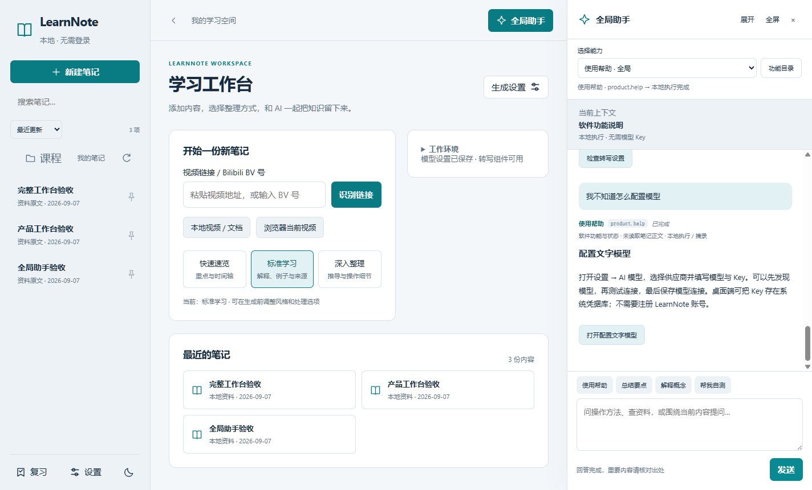
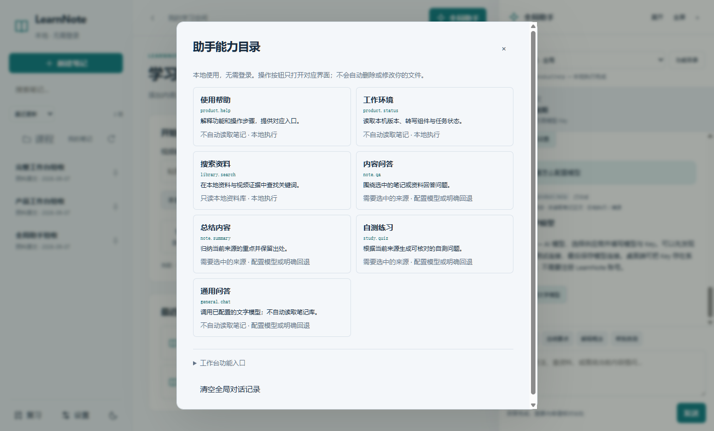

# 全局助手与应用 Skills · 0.2.3

助手面向整个 LearnNote，不要求先打开笔记，也不要求登录。这里的 Skill 是产品内的能力模块，不是 Codex 技能文件或可以任意执行系统命令的插件。

## 能力与执行边界

| Skill | 使用范围 | 执行 |
|---|---|---|
| product.help | 软件功能、操作方法 | 本地维护的功能知识；只提供导航入口 |
| product.status | 版本、转写组件、任务数量与队列 | 读取本机状态 |
| library.search | 本地已索引来源 | 关键词检索并展示原文 |
| note.qa | 选中的视频笔记或文档 | 视频使用现有模型/来源问答；文档使用原文检索 |
| note.summary | 选中的来源 | 视频总结；没有模型能力时明确显示摘录回退 |
| study.quiz | 选中的来源 | 基于来源自测；摘录回退不冒充模型出题 |
| general.chat | 通用对话 | 用户配置的文字模型，不自动读取笔记或文件 |

自动模式在本机按明确的操作意图和是否有来源匹配能力；未匹配到软件操作、也没有选中来源时，使用通用问答（需要模型）。用户可手动更正。每次回复展示 Skill 名称、ID、上下文范围及实际执行方式。功能目录同时提供软件功能入口。模型输出不会被当作可执行操作；删除、迁移、清理等仍由用户在对应界面确认。

本地帮助不调用远程模型。通用问答和视频模型问答使用现有模型配置，未配置或失败会明确提示。全局帮助与通用对话记录独立保存在数据目录的 assistant-history.json，最多保留最近 80 条；功能目录提供清空入口。各视频原有的问答历史继续保留，新增调用 Skill 标记。删除一篇笔记不会自动清空独立的全局对话记录。

## 交互

- 弹窗支持点击遮罩和 Esc 关闭；从窗口内拖动到外部不会误关闭。
- 设置、课程编辑和个人补充编辑存在未保存内容时，关闭或返回前提醒。
- 工具页有语义返回入口，主工作台有返回上一位置的按钮。
- 侧栏笔记支持置顶和按更新、名称、处理中优先排序。
- 只使用短暂的状态过渡与弹窗动效，尊重 prefers-reduced-motion。
- 保留本地工作台结构与可见参数；不引入登录、账号或云端任务要求。

## 验证

backend/tests/test_assistant_skills.py 覆盖路由、缺少来源、未知能力拒绝、本地帮助无模型运行、缺少模型配置和本地历史。scripts/global-assistant-acceptance.cjs 覆盖无笔记帮助、Skill 显示与目录、导航入口、遮罩关闭、未保存保护、置顶、返回、历史回读和窄屏。

首页继续突出新建与最近内容；运行环境改为可展开的次级信息，并记住展开偏好，减少与主操作竞争。

## 本轮验收结果

后端完整回归 459 项通过，脚本和桌面回归继续通过。实际 Windows 0.2.3 打包程序通过全局帮助、显式 Skill、缺少上下文提示、功能目录、遮罩关闭、未保存保护、返回、置顶、历史回读和手机宽度检查；原工作台与工具流程也通过。模型调用使用模拟或缺配置分支验证，未把真实模型效果当作本轮通过结论。

